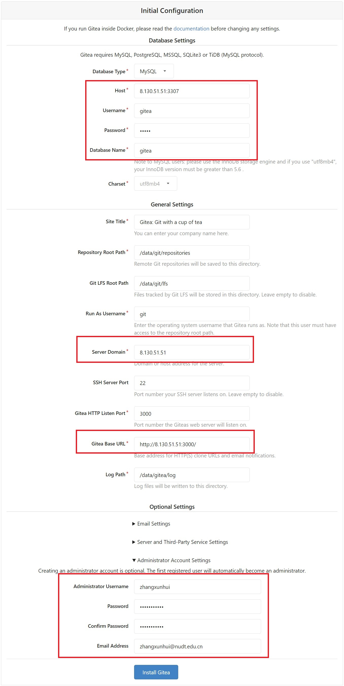
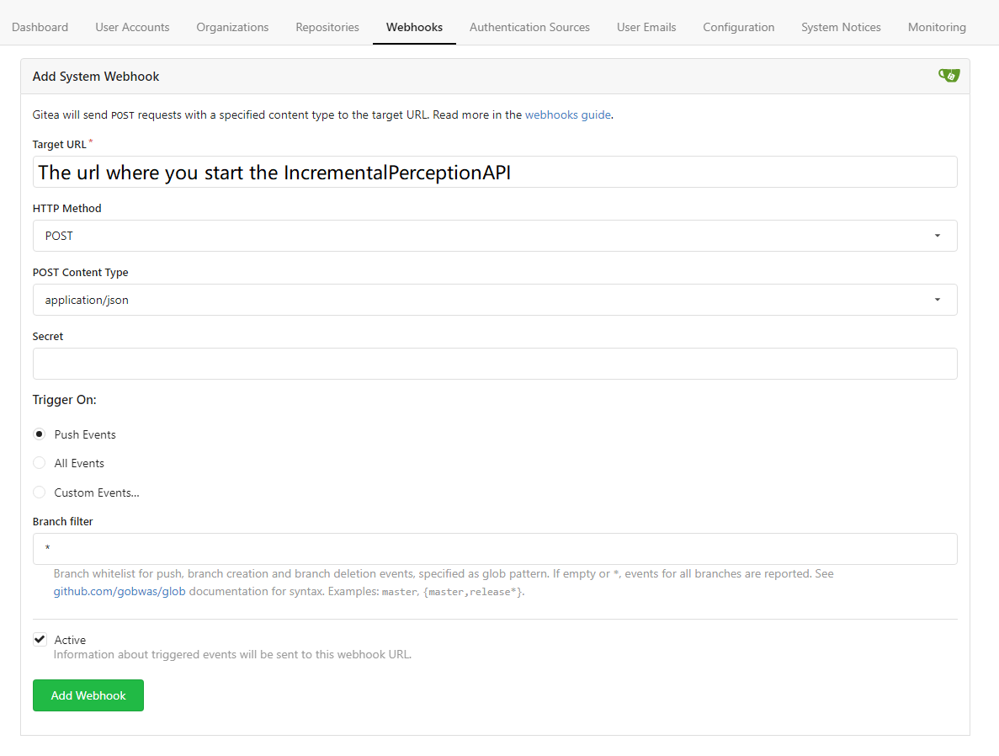

# LSICCDS_server
LSICCDS (large-scale incremental code clone detection system)

## How to use this
First of all, you need to clone this repository into your own server.

As all the dependent parts are based on docker. So install docker on your server first. Here is a [guide](https://www.digitalocean.com/community/tutorials/how-to-install-and-use-docker-on-ubuntu-20-04) for ubuntu 20.04.
Then install docker-compose by running `sudo apt install docker-compose`.

Add priviledge for the user.
```
sudo groupadd docker
sudo gpasswd -a $USER docker
newgrp docker
docker ps # test whether docker command can be used
```

Install docker-compose following this [guide](https://www.digitalocean.com/community/tutorials/how-to-install-and-use-docker-compose-on-ubuntu-20-04).

Install the dependencies using the following steps:

1. `docker network create LSICCDS_server` to create the network.
2. `cd dependencies`
3. `docker-compose up -d` to install all the dependent services, including gitea (the dependent mysql), rabbitmq, elasticsearch, kibana.
  - Error may occur when installing elasticsearch and kibana, you need to:
    - `sudo chmod 777 -R elasticsearch`
    - `sudo chmod 777 -R kibana`
    - `docker-compose up -d`
4. Configure the gitea settings for initialization. See the figure below.

<details>
  <summary>Click to present.</summary>

  You need to change the IP address and the administrator account by yourself.

  
</details>

5. Configure the gitea system webhook for the incremental perception service. See the figure below.

<details>
  <summary>Click to present.</summary>

  You need to change the IP address and the administrator account by yourself.

  
</details>

6. Create python virtual environment using command `conda create -n LSICCDS_server python=3.7.11` based on conda. (Before this you need to install conda following this [guide](https://linuxize.com/post/how-to-install-anaconda-on-ubuntu-20-04/#:~:text=Complete%20the%20following%20steps%20to%20install%20Anaconda%20on,In%20order%20to%20continue%20the%20installation%20process%2C%20).)


7. Activate the python virtual environment using command `conda activate LSICCDS_server`.

8. Install dependent python packages using command `pip install -r requirements.txt`.

9. Change the working directory to the `services` directory using command: `cd ../services`.

10. Change the configuration:
  - Copy the configuration file from the template using command: `cp config-template.yml config.yml`;
  - Change `gitea/repositories_path`;
  - Change `elasticsearch/urls` and the names of indexes, including `elasticsearch/index_ngram` and `elasticsearch/index_handled_commits` as you want;
  - Change `mysql`;
  - Change `rabbitmq`;
  - Change the number of threads for running `coldstart_service` and `incremental_service`;
  - Change the absolute base path of `nil`;
  - Change `client_service`:
    - `gitea_url` is the address of your local gitea service;
    - `token` is personal account token in which you installed the client service.

11. Change the python path in `restart_services.sh` file.

12. Run the service using command: `bash restart_services.sh`.

## The tree of this project
```
.
├── dependencies -- the dir for dependencies of LSICCDS
│   ├── docker-compose.yml -- the docker-compose starting the dependencies
├── LICENSE -- the license file
├── pics -- the pictures in README.md file
│   ├── gitea-setting.jpeg
│   └── gitea-system-webhook-setting.png
├── pyproject.toml
├── README.md
├── requirements.txt -- the requirements of python packages
└── services -- the services of LSICCDS
    ├── ChangedMethodExtractor.py -- the class for extracting changes in source code file
    ├── CloneDetectionAPI.py -- the Clone Detection and Search services
    ├── CloneDetection.py -- the class for clone detection related methods
    ├── ColdStartPerception.py -- the Cold Start Service
    ├── config-template.yml -- the template of configuration file
    ├── ESUtils.py -- the utility file of Elasticsearch
    ├── IncrementalPerceptionAPI.py -- the producer of Incremental Service
    ├── IncrementalPerceptionHandler.py -- the consumer of Incremental Service
    ├── __init__.py
    ├── LCS.py -- Longest Common Subsequence algorithm
    ├── models -- the models defined for running the service
    ├── MySQLUtils.py -- the utility file of mysql
    ├── parser
    |   ├── FuncExtractor_nil.py -- the script of invoking function extractor of NIL
    |   └── nil -- the function extractor of NIL
    ├── RabbitmqUtils.py -- the utility file of rabbitmq
    ├── restart_services.sh -- the script for restarting LSICCDS's services
    └── utils.py -- the utility file
```
